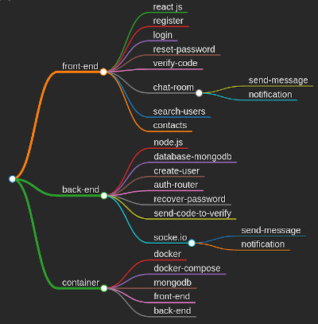

# Web chat with React Js, Node.js and Docker

 

## 1 - Steps

There are three steps to build this project, like we can see in this image below. How we can see the core of this project are: React Js, Node.js and Docker Container.

 
 

    <kbd>
        
    </kbd>

##

The front-end and the back-end are developed in parallel, and finally the docker image are built to run the three containers.

All the dependencies are in each dir in package.json file

## 2 - Front-End

### Authentication Guard System
The AuthGuard protect the pages that need the user sign in, redirecting to login page.

To verify the user state was implemented a context and to store the user data I use React-Redux.

The main folders of "AuthGuard System" are: contexts, hooks, store and utils.

### Pages

* Register page;

## 3 - Back-End

...

## 4 - Docker-Container

...
## 5 - How to install and run this project?

...